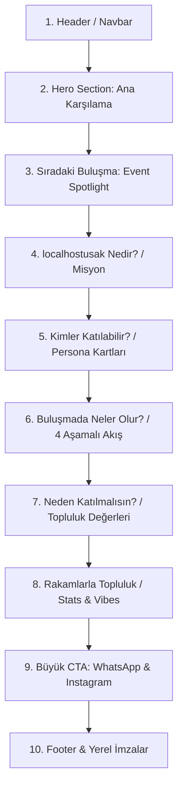

# localhostusak — Web Sitesi Mimarisi ve Tasarım Dili Entegrasyonu Beyin Fırtınası

Bu doküman, `References/` klasöründeki afiş ve duyuru tasarımlarından çıkarılan iki temel tasarım dilini (**Modern Cyber-Local** ve **Cozy Pixel Art**) bir web sitesinin mimarisinde nasıl en verimli, etkileyici ve kullanıcı dostu şekilde birleştirebileceğimizi ele alır.

---

## 1. Topluluk Kimliği ve Temel Mesajlar

Web sitesinin her iki tasarım dilinde de vermesi gereken ana mesajlar afişlerden derlenmiştir:
- **Kimlik:** Uşak'taki developerlar, mühendisler, tasarımcılar, remote çalışanlar, öğrenciler ve teknoloji meraklıları için yerel topluluk.
- **Duruş:** *"Deneyimli olmak şart değil; merak, öğrenme isteği ve samimiyet en önemli ortak noktamız."*
- **Aksiyon:** *"Kahveni al, laptopunu getir, aramıza katıl."*
- **Sloganlar:** `CONNECT • CODE • CREATE • COMMUNITY` / `Good Code, Better People` / `Merakın varsa, masada sana da yer var.`

---

## 2. Ana Sayfa Bilgi Mimarisi (Page Structure)

Aşağıdaki bölümleme, kullanıcının sitede geçireceği yolculuğu en yüksek etkileşim ve güven oluşturacak şekilde kurgular:

---

### Bölüm Detayları ve İki Dildeki Karşılıkları

| # | Bölüm Adı | İçerik ve Amaç | Modern Tasarımda Görünüm | Pixel Art Tasarımda Görünüm |
|---|---|---|---|---|
| **1** | **Navbar** | Logo, Menü Linkleri, Sonraki Buluşma Geri Sayımı, Tema Değiştirici | Koyu cam efektli (`glassmorphic`) bar, neon turuncu logo, terminal tarzı linkler (`/events`, `/about`) | 3px siyah pikselli çerçeve, retro butonlar, basamaklı köşe tasarımı |
| **2** | **Hero (Giriş)** | Çarpıcı başlık, Uşak vurgusu, ana aksiyon butonları | Blaundus Antik Kenti ışık huzmesi veya Cilandiras Kanyonu gece görseli, `>_ connect • build`, glow buton | Kafe masasında laptoplarıyla oturan pikselli ekip illüstrasyonu, `LOCAL HOST UŞAK İLK BULUŞMA` piksel başlık |
| **3** | **Sıradaki Buluşma** | Tarih, saat, mekan, harita pini, "Takvime Ekle" butonu | Devre kartı hatlarıyla bağlı HUD etkinlik kartı, dairesel parlayan lokasyon pini | Ahşap kafe tabelası formunda piksel kutu, 8-bit takvim ve kahve kupası ikonu |
| **4** | **Nedir? / Neden Kuruldu?** | Topluluğun kuruluş amacı, yalnız çalışmayı kırma hedefi | Terminal penceresi (`// birlikte daha güçlü // kodluyoruz`), `{}` ve `</>` ikon blokları | Sol tarafı piksel ikonlu diyalog kartları, sağda piksel Uşak saat kulesi manzarası |
| **5** | **Kimler Katılabilir?** | 4 Kategori: Developer, Designer, Remote/Freelance, Öğrenci | Grid kartlar, üzerine gelince turuncu neon devre ışıması | 4 ayrı dikey 8-bit çerçeve: piksel laptop, palet/fırça, piksel dünya, mezuniyet kepi |
| **6** | **Buluşma Akışı** | 1. Tanışma, 2. Kahve/Sohbet, 3. Çalışma, 4. Networking | Dikey/Yatay fütüristik timeline akış çizgisi, parlayan adımlar | 1-2-3-4 numaralı retro rozetler, konuşma balonları, sıcak ahşap tonları |
| **7** | **Neden Gelmelisin?** | Masada sana da yer var, samimiyet, ilham | "Sen de katıl" HUD kutusu, temiz modern tipografi | Turuncu piksel şerit, piksel kalp (`🧡`), retro yıldız ikonları |
| **8** | **Sosyal Kanıt & İstatistik** | Buluşma sayısı, üye sayısı, içilen kahve | Monospace sayaçlar (`COUNT: 150+ DEV`, `COFFEE: ∞`) | 8-bit skor tabelası (`HIGH SCORE / STATS`), piksel insan figürleri dizilimi |
| **9** | **Büyük CTA (Katıl)** | WhatsApp ve Instagram doğrudan katılım alanı | Neon parlayan büyük butonlar, QR kod alanı | Basmalı arcade butonları, piksel Instagram/WhatsApp logoları |
| **10** | **Footer** | Uşak koordinatları, açık kaynak github linki, telif | `[ 📍 U Ş A K ]` alt pill, telif satırı, minimalist monospace linkler | Pikselli insan zinciri (`🧍🧍🧍🧍🧍`), `CONNECT • COFFEE • COMMUNITY` bandı |

---

## 3. İki Tasarım Dilini Kullanma Stratejileri (Beyin Fırtınası)

İki tasarım dili de çok güçlü görsel kimliklere sahip. Bu dilleri web sitesinde değerlendirmek için 3 ana mimari seçenek öne çıkıyor:

### 🏆 Seçenek A: "The Reality Glitch" — Oyunlaştırılmış Çatlak ile Piksel Evrene Geçiş (ÖNERİLEN)

Kullanıcıya sıradan bir switch butonu yerine, web dünyasında büyük yankı uyandıracak (Awwwards / FWA kalitesinde) interaktif bir oyunlaştırma (Easter Egg) sunulur:

#### Mekanik: 3 Vuruşta Gerçeklik Kırılması (The 3-Hit Breach)
Sitenin bir köşesinde (veya Hero bölümündeki devre kartının üzerinde) hafifçe titreyen, neon ışık sızdıran gizemli bir **"Boyut Çatlağı / Glitch Noktası"** yer alır (`[ ⚡ Warning: Reality Fracture ]`).

1. **1. Tıklama (Hafif Çatlak & Glitch):**
   - Ekranda mikro bir sarsıntı (screen shake) gerçekleşir.
   - Devre kartı üzerinde çatlak yarıkları oluşur (`SVG Fracture / Polygon Clip-path`).
   - Çatlağın içinden sıcak krem rengi 8-bit piksel dokusu ve minik bir piksel kalp (`🧡`) veya buharlı kahve kupası göz kırpar.
   - Web Audio API ile retro bir "çatırtı / blip" ses efekti çalar.
   - İpucu rozeti belirir: `[ ⚠️ Reality Integrity: 66% — Bir daha dokun! ]`

2. **2. Tıklama (Büyük Yırtılma & Sızıntı):**
   - Sarsıntı belirginleşir, ekranın köşelerinde geçici 8-bit parazitler (CRT glitch) belirir.
   - Çatlak alanı büyür; çatlak arasından retro pikselli yazılar, Uşak piksel saat kulesinin ucu ve 8-bit parçacıklar (pixel particles) etrafa saçılır.
   - Retro synth "crunch" sesi duyulur.
   - İpucu rozeti: `[ 🚨 Reality Integrity: 33% — Kritik Seviye! Son bir darbe... ]`

3. **3. Tıklama (Kırılma & Piksel Patlaması - Big Bang):**
   - Ekran cam kırılması ve piksel patlaması efektiyle (Pixel Shatter FX) tamamen çatlar!
   - Tüm sayfa bir anda o sıcacık krem renkli, pikselli, kafe masalı **Cozy Pixel Art** moduna geçer (`data-theme="pixel"`).
   - 8-bit zafer melodisi (victory jingle) çalar ve ekranda nostaljik bir arcade kutlaması belirir:
     `✨ LEVEL UNLOCKED: COZY RETRO MODE! ☕🕹️`
   - Bütün butonlar, kartlar, başlıklar ve arka planlar anında retro 16-bit haline bürünür.

#### Geri Dönüş Mekanizması (System Restore / Reality Reboot):
- Pixel Art moduna geçildiğinde sağ üst köşede nostaljik bir 8-bit disket veya arcade butonu belirir:
  `[ 💾 SYSTEM RESTORE / MODERN MOD ]`
- Kullanıcı buna bastığında CRT televizyon kapanma çizgisi veya terminal reboot animasyonuyla modern karanlık moda geri döner.
- Kullanıcının tercihi `localStorage`'da saklanır, ancak her zaman tekrar kırıp geçiş yapabilir!

---

### Seçenek B: "The Cozy Cyber Hybrid" (Modern İskelet + Pixel Sanatı Dokunuşları)
Tasarımı ikiye bölmek yerine, modern web ergonomisi ile nostaljik piksel sıcaklığını tek bir potada eritmek.
- **Nasıl Çalışır?**
  - **Genel Yapı & Tipografi:** Modern Dark Mode (gözü yormayan koyu zemin, yüksek okunabilirlikli Inter/Outfit fontları, temiz responsive grid).
  - **Görseller & İllüstrasyonlar:** Hero görselinde o sıcak ahşap masalı piksel kafe illüstrasyonu kullanılır.
  - **Rozetler & İkonlar:** Kartların içindeki ikonlar (kahve, laptop, kalp, mezuniyet kepi) 8-bit piksel çizimlerden oluşur.
  - **Mikro Etkileşimler:** Butonların üzerine gelindiğinde hafif retro ses efekti (opsiyonel) veya 8-bit piksel sıçrama animasyonu.
- **Avantajı:** Tek bir tutarlı tasarım dili oluşturur, hem profesyonel hem çok cana yakın durur.

---

### Seçenek C: "Section-Based Theming" (Mekana Göre Tasarım Değişimi)
Sitedeki bölümlerin konusuna göre tasarım dilinin ton değiştirmesi:
- **Modern Dark Katmanı:** Hero, Vizyon, Mühendislik/Yazılım alanları, Sponsorlar ve İstatistikler. (Ciddiyet, teknoloji, Uşak'ın geleceği).
- **Pixel Art Kafe Katmanı:** "Buluşmada Neler Olacak?", "Kafe Masası & Coworking", "Kahveni Al Gel" bölümleri sarı/krem piksel kutularla sunulur. (Sıcaklık, eğlence, insan ilişkileri).

---

## 4. Kullanıcı Deneyimi (UX) ve Dönüşüm (Conversion) Odaklı Öneriler

1. **Birincil Aksiyon (Primary Goal):**
   - Topluluğun en aktif olduğu kanal **WhatsApp Topluluk Grubu** ve **Instagram**.
   - Masaüstünde tıklandığında WhatsApp Web veya doğrudan katılım linki; mobilde doğrudan WhatsApp uygulamasına yönlendirme.
   - Her ekran kaydırmasında (scroll) sağ altta asılı duran (floating) bir `[ 💬 WhatsApp'a Katıl ]` butonu.

2. **Etkinlik Takvimi & Geri Sayım:**
   - Bir sonraki buluşmaya kalan süreyi gösteren dinamik geri sayım sayacı (`3 gün 14 saat kaldı`).
   - "Google Takvime Ekle" ve Apple Calendar `.ics` indirme butonuyla katılım oranını maksimize etme.

3. **Mekan Kartı (Uşak Yerelliği):**
   - Kafe adı (Örn: Treehouse Kafe / Coff The Story) tıklandığında Google Maps / Apple Maps doğrudan navigasyonu açmalı.

4. **"İlk Kez Geliyorum, Çekinmeli miyim?" SSS Modülü:**
   - *"Yalnız gelebilir miyim?"* ➔ *"Evet, zaten amacımız tanışmak! Masada herkese yer var."*
   - *"Hangi seviyede olmalıyım?"* ➔ *"Öğrenci de olsan, 10 yıllık mühendis de olsan başımızın üstünde yerin var."*

---

## 5. Teknoloji Yığını (Tech Stack) ve Mimari Değerlendirmesi

Topluluk web sitesinin ihtiyaçları (çatlak oyunlaştırması, çift tema yönetimi, mobil öncelikli hızlı açılış ve geliştiricilere hitap eden modern kod yapısı) doğrultusunda 3 temel mimari seçenek değerlendirilmiştir:

### Mimari Seçenekler Karşılaştırması

| Kriter | Seçenek 1: React 19 + Vite (TypeScript) *(ÖNERİLEN)* | Seçenek 2: Astro (Islands Architecture) | Seçenek 3: Pure Vanilla (HTML5 + Modern CSS + JS) |
| :--- | :--- | :--- | :--- |
| **Bileşen & Animasyon Ekosistemi** | **Çok Güçlü:** Framer Motion, React Bits, Uiverse ve hazır bileşenler doğrudan entegre edilebilir. | **Güçlü:** İstenen interaktif bölümler React adacığı olarak yüklenir, statik kısımlar sıfır JS ile gelir. | **Hafif:** Dış bağımlılık yoktur; ancak her animasyon ve tema durumu sıfırdan yazılır. |
| **Performans & Bundle Boyutu** | **Yüksek:** Vite ile optimize edilmiş hafif bundle (~120-160 KB). | **Maksimum:** Statik HTML çıktısı ile neredeyse sıfır JavaScript yükü. | **Ultra Hızlı:** Tek dosya/statik servis, sıfır derleme adımı. |
| **Çatlak & Tema Değişimi (State)** | `useTheme` / Context API ve CSS Variables ile kusursuz senkronizasyon. | Client adacıkları ve DOM `data-theme` ile rahatça yönetilir. | `document.documentElement.setAttribute` ile saf JS üzerinden. |
| **Gelecek Entegrasyonları (Etkinlik, Form)** | **Genişlemeye Çok Uygun:** Dinamik filtreleme, kayıt formları, API çağrıları için hazır. | Oldukça uygun. | Kod büyüdükçe spagetti DOM koduna dönüşme riski taşır. |

> 🏆 **Önerilen Karar:** **React 19 + Vite + TypeScript + CSS Design Tokens (Vanilla CSS / Tailwind v4)**  
> **Gerekçe:** `Web_Gelistirme_Araclari_Rehberi.md` içindeki en etkileyici araçların (`React Bits`, `Dotmatrix Loaders`, `Motion.dev`, `ItsHover`) doğrudan React ekosisteminde native çalışması ve geliştirici topluluğuna modern bir açık kaynak referansı sunması.

---

## 6. Web Geliştirme Araçları Rehberi (@Web_Gelistirme_Araclari_Rehberi.md) Entegrasyon Matrisi

Rehberdeki 161 analiz postundan derlenen araçlar taranmış ve localhostusak web sitesine doğrudan güç katacak olanlar projenin ilgili modüllerine eşlenmiştir:

### 6.1. Çatlak (Reality Breach) & Oyunlaştırma Motoru
- 💥 **Motion.dev (Framer Motion)** *(Rehber Bölüm 5)*:
  - 3 vuruşlu çatlağın ekran sarsıntısı (screen shake), SVG çatlak polygonlarının tıklama bazlı genişlemesi ve 3. tıklamadaki tam ekran patlama (shatter) geçişini 60 FPS hızla yönetir.
- ⚡ **Anime.js** *(Rehber Bölüm 5)*:
  - Çatlak yarıldığında içeriden dışarıya fırlayan 8-bit parçacıkların (pixel particles / retro sparks) fizik tabanlı saçılma animasyonunu üstlenir.
- 🔤 **Colorion Text Effects** *(Rehber Bölüm 6)*:
  - Modern modda çatlak anomalisi uyarısında (`[ ⚠️ Reality Integrity: 66% ]`) ve ana başlıkta anlık *Glitch & Cyber-Flicker* efektlerini saf CSS ile sıfır harici yükle sağlar.

### 6.2. Modern Cyber-Local HUD Tasarımı Araçları
- 🌌 **React Bits 3D Bileşenleri (`reactbits.dev`)** *(Rehber Bölüm 1)*:
  - Hero bölümünde Blaundus Antik Kenti ve Uşak kanyonu gökyüzüne, fare hareketini takip eden derinlikli bir uzay simülasyonu (**Galaxy**) veya parıldayan siber küpler (**Cubes**) ekler.
- 📟 **Dotmatrix Loaders (`dotmatrix.zzzzshawn.cloud`)** *(Rehber Bölüm 4)*:
  - Afişlerdeki matris desenlerini web arayüzünde canlı LED/Matrix yükleme animasyonlarına ve kart köşe sinyallerine dönüştürür.
- 🌊 **ShaderGradient (`ruucm/shadergradient`)** *(Rehber Bölüm 6)*:
  - Sayfa arka planında derin obsidyen siyahı üzerinde Uşak turuncusu ve neon lazer mavisinin lav gibi aktığı sinematik bir zemin oluşturur.
- 💎 **liquid-glass-js** *(Rehber Bölüm 6)*:
  - Koyu cam kartların (`glassmorphism`) üzerine fare geldiğinde Apple tarzı gerçekçi ışık kırılması ve yansıma etkisi üretir.

### 6.3. Cozy Pixel Art Kafe Tasarımı Araçları
- ☕ **Dithered Swirl Backgrounds (`aliiman.in`)** *(Rehber Bölüm 6)*:
  - Pixel Art moduna geçildiğinde sıcak krem arka plana 8-bit tram/dither deseni giydirerek nostaljik GameBoy ve retro indie hacker atmosferi yaratır.
- 🕹️ **Uiverse.io & Cult-UI** *(Rehber Bölüm 4)*:
  - Butonlara tıklandığında basamaklı olarak aşağı çöken mekanik arcade buton (tactile click) hissi ve basmalı piksel kart stilleri sunar.
- 👾 **Asciinator (`asciinator.app`)** *(Rehber Bölüm 7)*:
  - Terminal bölümü içine Uşak Saat Kulesi'nin veya topluluk logosunun saf ASCII karakterlerinden üretilmiş çizimini yerleştirir.

### 6.4. Arayüz Kalitesi, Mikro Etkileşimler ve Erişilebilirlik
- 🎯 **ItsHover (`itshover.com`)** *(Rehber Bölüm 4)*:
  - Üzerine gelindiğinde buharı tüten kahve kupası, nabız gibi atan lokasyon pini ve parıldayan kod tagleri gibi 186+ niyet odaklı canlı ikon seti.
- ✨ **Emil Kowalski AI Skill (`emilkowal.ski/skill`)** *(Rehber Bölüm 3)*:
  - Linear ve Vercel standartlarında mikro yaylanma animasyonları (spring physics), pürüzsüz kart hover geçişleri ve Apple arayüz ergonomisi standartları.
- 👁️ **Randoma11y & Color Palette Fixer** *(Rehber Bölüm 8)*:
  - Hem koyu modda hem de açık krem zemininde Uşak turuncusunun WCAG AAA kontrast standartlarına (4.5+ puan) uygunluğunu garanti eder.

### 6.5. Arka-Yüz & Gelecek Topluluk Entegrasyonları
- 💬 **Evolution Go** *(Rehber Bölüm 9)*:
  - Sıradaki buluşmalar için siteden tek tıkla "Buluşmayı bana WhatsApp'tan hatırlat" özelliği eklendiğinde, ücretsiz ve bağımsız WhatsApp API entegrasyonu sunar.
- 🤖 **Firecrawl / Scout** *(Rehber Bölüm 9)*:
  - İleride Uşak ve çevre illerdeki yazılım/teknoloji etkinliklerini otomatik olarak tarayıp topluluk takvimine çekmek için kullanılabilir.

---

## 7. Uygulama ve Teknik Yol Haritası

1. **Faz 1 — Altyapı ve Token Kurulumu:** Vite + React + TypeScript + Çift Tema CSS Variables (`data-theme="modern"` ve `"pixel"`).
2. **Faz 2 — Çatlak (Reality Breach) Mekaniğinin Kodlanması:** Framer Motion + SVG Polygon maskeleme + Web Audio API 8-bit synth sesleri.
3. **Faz 3 — Bölüm Bileşenlerinin İnşası:** Navbar, Hero (React Bits Galaxy / Pixel Cafe), Event Spotlight, Katılımcı Kartları, 4 Aşamalı Buluşma Akışı.
4. **Faz 4 — Mikro Etkileşimler & Cila (Polish):** ItsHover ikonları, Dotmatrix detayları, Uiverse buton fizikleri.
5. **Faz 5 — Mobil & Erişilebilirlik Testi:** WCAG AAA renk testi, tüm cihazlarda 60 FPS performans ve SEO etiketleri.
